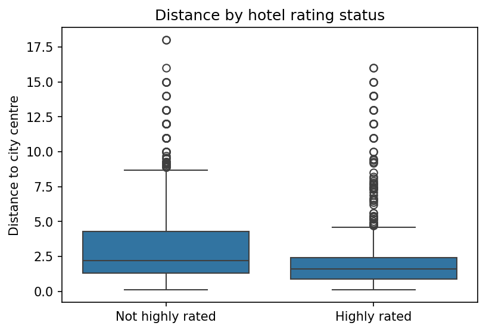
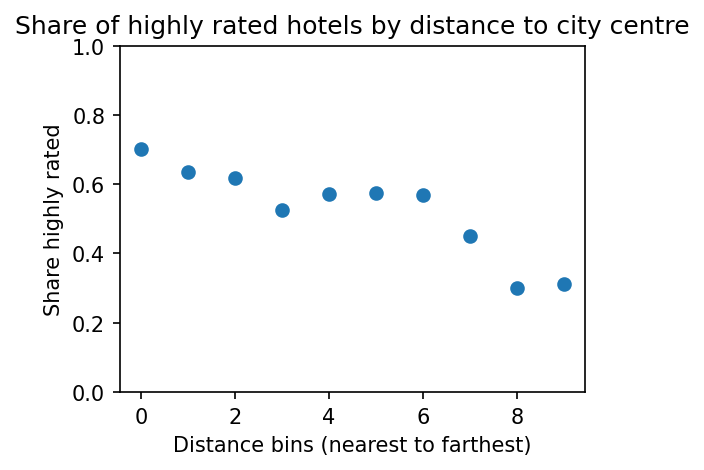
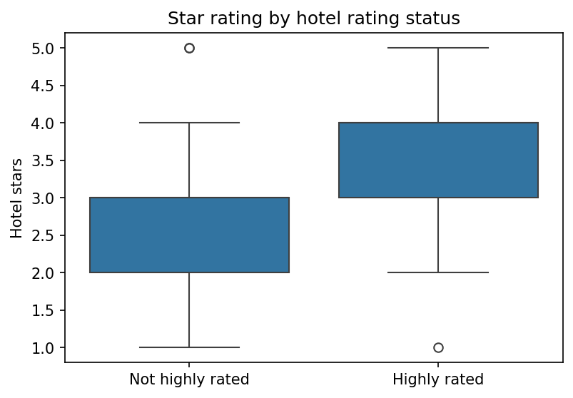
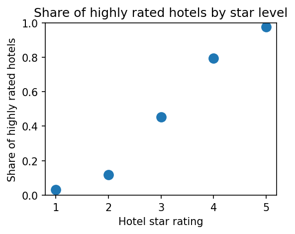
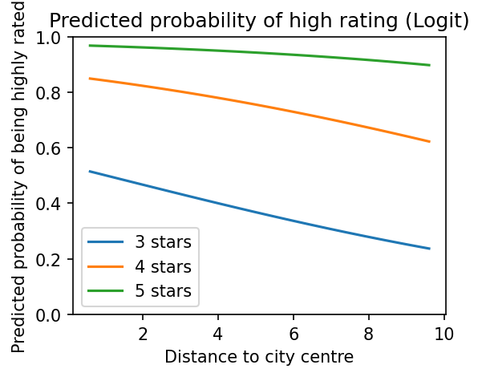

# Determinants of High Hotel Ratings in Paris
**Course:** ECBS5142 - Data Analysis 2  
**Author:** Zariza Chowdhury (ID: 2500086)  
**Dataset:** Hotels Europe (N = 1,440 after filtering)  
**City:** Paris  
**Source:** https://osf.io/

---

## Overview

This project studies what determines whether a Paris hotel receives a high user rating. I combine hotel features and price data from the hotels-europe dataset and use a binary outcome variable (highly rated = 1 if average rating >= 4) to estimate linear probability, logit, and probit models. The two main explanatory variables are distance to the city centre and hotel star classification.

---

## Key Decisions

- **Outcome variable:** A hotel is classified as highly rated if its average user rating is at least 4. This threshold produces a roughly balanced binary variable (53% highly rated).
- **Baseline booking condition:** Prices were filtered to one night, weekday, non-holiday to ensure one observation per hotel before merging with features.
- **Sample:** Paris was selected as the city with more than 250 hotels after filtering. After dropping observations with missing values in rating, stars, or distance, the final sample is N = 1,440.
- **Standard errors:** The linear probability model uses heteroskedasticity-robust standard errors (HC1), as taught in class. Logit and probit models use maximum likelihood estimation with marginal effects computed at the mean.

---

## Exploratory Data Analysis

About 53% of hotels in Paris are classified as highly rated. Compared to lower-rated hotels, highly rated hotels are on average closer to the city centre (mean distance 2.23 km vs 2.86 km), have higher star ratings, and charge slightly higher prices.

### Distance and Rating

Highly rated hotels tend to be more centrally located. The box plot below shows that the distribution of distances is shifted lower for highly rated hotels, with a smaller spread and fewer extreme outliers.

The bin-scatter plot confirms this pattern more clearly. Dividing hotels into 10 distance bins from nearest to farthest, the share of highly rated hotels declines steadily as distance from the centre increases. The nearest bin has a share of around 0.70, while the two farthest bins fall to around 0.31.

### Stars and Rating

Hotel star classification shows a strong positive relationship with the likelihood of being highly rated. The box plot shows that highly rated hotels have a noticeably higher median star rating, with the interquartile range sitting mostly between 3 and 4 stars compared to 2 to 3 stars for lower-rated hotels.

The scatter plot of share of highly rated hotels by star level makes the gradient stark. Only around 3% of 1-star hotels are highly rated, compared to nearly 98% of 5-star hotels.

---

## Regression Models

I estimated three models using distance and hotel stars as explanatory variables: a linear probability model (OLS), a logit model, and a probit model. All three produce consistent results in terms of sign, significance, and magnitude.

### Linear Probability Model

$$P(\text{highly\_rated} = 1) = \beta_0 + \beta_1 \cdot \text{distance} + \beta_2 \cdot \text{stars} + \varepsilon$$

| Variable | Coefficient | Std. Error | p-value |
|---|---|---|---|
| Intercept | -0.3418 | 0.042 | < 0.01 |
| Distance | -0.0210 | 0.004 | < 0.01 |
| Stars | 0.2879 | 0.011 | < 0.01 |
| R-squared | 0.272 | | |
| N | 1,440 | | |

*Heteroskedasticity-robust standard errors (HC1). *** p < 0.01*

Each additional kilometre from the city centre is associated with a 2.1 percentage point decrease in the probability of being highly rated. Each additional star is associated with a 28.8 percentage point increase. Both coefficients are statistically significant at the 1% level. The model explains about 27% of the variation in the outcome.

### Logit and Probit Models

The logit and probit models produce similar results. Marginal effects at the mean are shown below.

**Table 1: Marginal Effects at the Mean**

| Variable | Logit dy/dx | Probit dy/dx |
|---|---|---|
| Distance | -0.0338*** | -0.0319*** |
| Stars | 0.4144*** | 0.3910*** |

**** p < 0.01. Standard errors and full model output available in the notebook.*

The logit marginal effect for distance implies a 3.4 percentage point decrease in the probability of being highly rated per additional kilometre, holding stars constant. The marginal effect for stars is 41.4 percentage points per additional star. The probit model gives nearly identical results, confirming robustness across model specifications.

---

## Predicted Probabilities

The predicted probability plot from the logit model illustrates how the two variables interact. For all star categories, the probability of being highly rated falls with distance. At any given distance, 5-star hotels have probabilities close to 1, while 3-star hotels start around 0.5 near the centre and drop to around 0.25 at 10 km out.

The gap between star categories remains wide across all distances, suggesting that star classification is a stronger predictor of high ratings than location alone.

---

## Summary

This analysis finds consistent evidence that distance to the city centre and hotel star classification are both associated with the probability of a hotel receiving a high user rating in Paris. Across all three model specifications, distance has a negative effect and stars have a positive effect, and both are statistically significant.

The logit marginal effects suggest that each additional kilometre reduces the probability of a high rating by about 3.4 percentage points, while each additional star increases it by about 41 percentage points. Predicted probabilities show that the star effect dominates: even far from the centre, 5-star hotels are very likely to be highly rated, while 3-star hotels face much lower probabilities regardless of location.

These results are descriptive and should not be interpreted as causal. Unobserved factors such as service quality, amenities, and hotel age likely drive both star ratings and user evaluations.

---

## Tools & Methods

- Python, pandas, NumPy
- statsmodels (OLS with HC1 robust standard errors, logit, probit, marginal effects)
- matplotlib, seaborn
- Dataset: Hotels Europe (source: https://osf.io/)